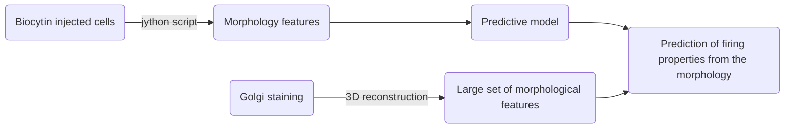

logo - badges

cm_biocytin is a simple way to extract data from neuron 3D reconstructions (from SNT fiji plugin) and build a model to predict their firing properties from their morphology.

## Basic overview



## key features

## Usage

### Input

1. Deposit your images and traces from the SNT semi-automated reconstruction in the "/input" folder.
2. Provide a .csv file of all the names of the tuplets .tif/.traces files you want to analyse in the folder "/table".

### Running the script

1. Activate pyimagej virtual environment before running the script. Then run the script "filling_extraction.py".
```bash 
mamba activate pyimagej
python filling_extraction.py
```
2. Remember to deactivate your pyimagej environment when done.
```bash
mamba deactivate
```

3. Use Jupyter notebook to investigate the best scikit-learn model to fit your dataset.

## Installation

"filling_extraction.py" needs python 3.8 as well as Maven and openjdk 11.0 in order to work (works with Jython). The script for tracing and extraction of the data from the neuron trace needs to run from a pyimagej environnement.
 Pip install scipy, numpy, sklearn and matplotlib in your environnement if needed.

### On Linux

1. If you don't have miniconda installed nor mamba to set up the environment you shall install it calling:

```bash
curl -L -O "https://github.com/conda-forge/miniforge/releases/latest/download/Miniforge3-$(uname)-$(uname -m).sh"
bash Miniforge3-$(uname)-$(uname -m).sh
```
or
```bash
wget "https://github.com/conda-forge/miniforge/releases/latest/download/Miniforge3-$(uname)-$(uname -m).sh"
bash Miniforge3-$(uname)-$(uname -m).sh
```

2. If you don't have java / openjdk installed: install it and check on your installation.

```bash
sudo apt-get install openjdk-11-jdk
java --version
```

3. Install pyimagej into a new virtual environment.

```bash
mamba create -n pyimagej pyimagej openjdk=11
```

4. Testing your installation:

```bash
mamba activate pyimagej
python -c 'import imagej; ij = imagej.init("2.14.0"); print(ij.getVersion())'
mamba deactivate
```

## Configuration options & troubleshoot

- Often the java heap size is not sufficient enought to run the script on large images/datasets. You can simply increase the java heap size if so you get the following error:
```bash
java.lang.OutOfMemoryError: Java heap space
```
or if the script breaks before the end.

## Contribution

## Licence
Redistribution, use and modification of this software is permitted provided that the above copyright and this notice and the following disclaimer are retained.

THIS SOFTWARE IS PROVIDED BY THE AUTHOR AND CONTRIBUTORS ``AS IS'' AND ANY EXPRESS OR IMPLIED WARRANTIES, INCLUDING, BUT NOT LIMITED TO, THE IMPLIED WARRANTIES OF MERCHANTABILITY AND FITNESS FOR A PARTICULAR PURPOSE ARE DISCLAIMED. IN NO EVENT SHALL THE AUTHOR OR CONTRIBUTORS BE LIABLE FOR ANY DIRECT, INDIRECT, INCIDENTAL, SPECIAL, EXEMPLARY, OR CONSEQUENTIAL DAMAGES (INCLUDING, BUT NOT LIMITED TO, PROCUREMENT OF SUBSTITUTE GOODS OR SERVICES; LOSS OF USE, DATA, OR PROFITS; OR BUSINESS INTERRUPTION) HOWEVER CAUSED AND ON ANY THEORY OF LIABILITY, WHETHER IN CONTRACT, STRICT LIABILITY, OR TORT (INCLUDING NEGLIGENCE OR OTHERWISE) ARISING IN ANY WAY OUT OF THE USE OF THIS SOFTWARE, EVEN IF ADVISED OF THE POSSIBILITY OF SUCH DAMAGE.
## Aknowledgements

This project wouldn't be possible without SNT add-on for ImageJ developped by Tiago Ferreira nor the constent enrichments that the community of https://forum.image.sc provides.

